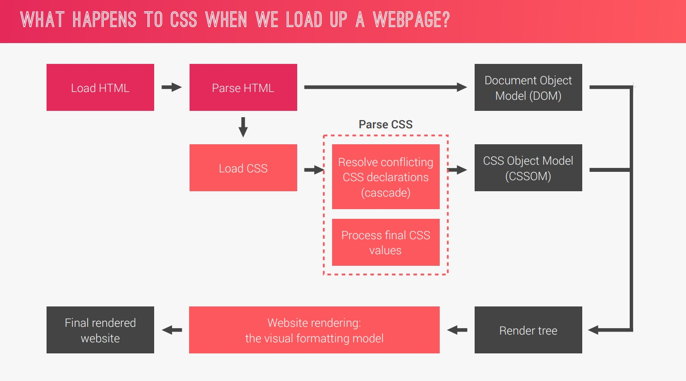

# Basics of HTML with it's DOM structure

### What happens to CSS when we load a webpage?



### Three pillars to write good HTML and CSS

1. Responsive Design
   - Fluid Layouts
   - Media Queries
   - Responsive Images
   - Correct Units
   - Desktop-first vs Mobile-first
2. Maintainable and scalable code
   - Clean
   - Easy to Understand
   - Growth
   - Reusable
   - How to organize files
   - How to name classes
   - How to structure HTML
3. Web performance
   - Less HTTP Requests
   - Less Code
   - Compress Code
   - Use a CSS Preprocessor
   - Less Images
   - Compress Images

### Simple reset using universal selector CSS

```css
* {
  margin: 0;
  padding: 0;
  box-sizing: border-box;
}

/* All will be inherited by the child elements */

body {
  font-family: "Lato", sans-serif;
  font-weight: 400;
  font-size: 16px;
  line-height: 1.7;
  color: #777;
}
```

### CSS | Clip-path property

- Clip path maker: https://bennettfeely.com/clippy/

- Lets you crop the element using various methods like

```css
/* Direction: Top-Left, Top-Right, Bottom-Right, Bottom-Left */
/* clip-path: polygon (x y, x y, x y, x y) */
/* Triangle */
clip-path: polygon(50% 0, 100% 100%, 0 100%);
```

# Basics of CSS with overview of animations

- CSS animation is done using keyframes at-rule (`@keyframes`) and `animation` property.

## There a 2 types of animation in CSS

### Simple: Using `transition` property

The `transition` property has to be on the initial state

```css
.btn {
  transition: all 0.2s;
}

.btn:hover {
  transform: translateY(-3px);
  /* Offset in X, Offset in Y, Blur, color */
  box-shadow: 0 10px 20px rgba(0, 0, 0, 0.2);
}

.btn:active {
  transform: translateY(-1px);
  box-shadow: 0 5px 10px rgba(0, 0, 0, 0.2);
}
```

### Complex: Using `@keyframes`.

```css
.heading-primary-main {
  animation-name: moveInLeft;
  animation-duration: 1s;
  animation-delay: 3s;
  animation-iteration-count: 3;
  animation-timing-function: ease-out;
}

/* Animation shorthand */
.heading-primary-sub {
  animation: moveInRight 1s ease-out;
}

@keyframes moveInLeft {
  0% {
    opacity: 0;
    transform: translateX(-100px);
  }

  80% {
    transform: translateX(10px);
  }

  100% {
    opacity: 1;
    transform: translate(0);
  }
}
```

# How CSS is parsed - Cascading and specificity

**Cascade**: Process of combining different stylesheets and resolving conflicts between different CSS rules and declarations, when more than one rule applies to certain element.


## Inheritence

- Is a way of propagating property values from parent elements to their children.

- Property related to text are inherited, for example, font-family, font-size, color etc.

- The computed value of a property is inherited, not the declared value.

# How CSS Renders a Website: The Visual Formatting Model

Algorithm that calculates boxes and determines the layout of these boxes, for each element in the **render tree**, in order to determine the final layout of the page.

1. Box Model
2. Box Types: Block-level, Inline, Inline-block
3. Positioning: Normal flow (position: relative), Float, Absolute
4. Stacking Context: Example `z-index, opacity, transform etc`

# CSS architecture, components and BEM

1. Componenet-driven design (Atomic Design)
2. BEM: Block Element Modifier

```css
.block {
}

.block__element {
}

.block_element--modifier {
}
```

3. The 7-1 Pattern: 7 different folders for partial Sass files, and 1 main Sass file to import all other files into a compiled CSS stylesheet.
   - base/
   - components/
   - layout/
   - pages/
   - themes/
   - abstracts/
   - vendors/

## Github Repo: https://github.com/jonasschmedtmann/advanced-css-course
