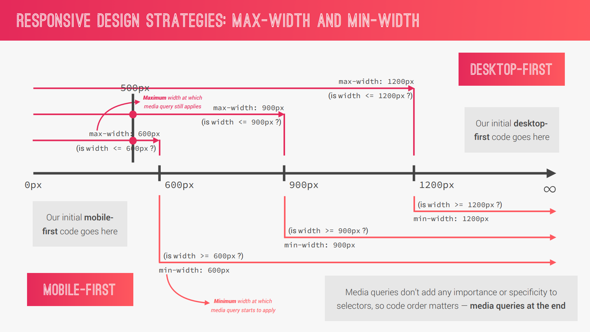

# Introduction to Sass and NPM

### SASS

Sass is a CSS preprocessor, an extension of CSS that adds power and elegance to the basic language.

#### Features of SASS

1. **Variables**: for resuable values for color, font-sizes, spacing etc
2. **Nesting**: nest selectors inside of one another, allowing us to write less code
3. **Operators**: mathematical operations right inside CSS.
4. **Partials and imports**: write CSS in different files and importing them all into one single file.
5. **Mixins**: resuable pieces of CSS code.
6. **Functions**: similar to mixins, with the difference that they produce a value that can be used.
7. **Extends**: to make different selectors inherit declarations that are common to all of them.
8. **Control directives**: for writing complex code using conditions and loops

# Sass - Variables, nesting, mixins, extends and functions

```scss
/* without argument */
@mixin clearfix {
  &::after {
    content: "";
    clear: both;
    display: table;
  }
}

/* with argument */
@mixin style-link-text($color) {
  text-decoration: none;
  text-transform: uppercase;
  color: $color;
}

@function divide($a, $b) {
  @return $a/ $b;
}

element {
  @include clearfix;
  @include style-link-text($color-text-light);
  /* not practical */
  margin: divide(60, 2) * 1px;
}
```

# Responsive designing and layout types

### Basic Responsive Design Principles

1. **Fluid Grids and Layouts**: To allow content to easily adapt to the current viewport width used to browse the website. Uses `%` rather than `px` for all layout-related lengths.

2. **Flexible/Responsive Images**: Images behave differently than text content, and so we need to ensure that they also adapt nicely to the current viewport.
3. **Media Queries**: Change styles on certain viewport widths (breakpoints), allowing us to create different version of our website for different widths.

# Mobile-First vs Desktop-First and Breakpoints

## Responsive Design Strategies

### Desktop-First

- Start wiring CSS for the desktop; large screen
- Then, media queries shrink to smaller screens (max-width)

### Mobile-First

- Start writing CSS for mobile devices; small screen,
- Then, media queries expand design to a large desktop screen,
- Forces us to reduce websites and apps to the absolute essentials (min-width)



# Writing Media Queries

```scss
@mixin respond-phone {
  @media (max-width: 600px) {
    @content;
  }
}

.className {
  width: 100%;
  @include respond-phone {
    width: 50%;
  }
}
```

### Media Query Manager

```scss
@mixin respond($breakpoint) {
  @if $breakpoint == phone {
    // 600px;
    @media (max-width: 37.5em) {
      @content;
    }
  }
  @if $breakpoint == tab-port {
    // 900px
    @media (max-width: 56.25em) {
      @content;
    }
  }
  @if $breakpoint == tab-land {
    // 1200px
    @media (max-width: 75em) {
      @content;
    }
  }
  @if $breakpoint == big-desktop {
    // 1800px
    @media (min-width: 112.5em) {
      @content;
    }
  }
}

/* 16px default, 62.5% will be calculated to 10px */
html {
  font-size: 62.5%;

  @include respond(tab-land) {
    font-size: 56.25%;
  }

  @include respond(tab-port) {
    font-size: 50%;
  }

  @include respond(big-desktop) {
    font-size: 75%;
  }
}
```

# Responsive images in HTML, CSS with browser supports
