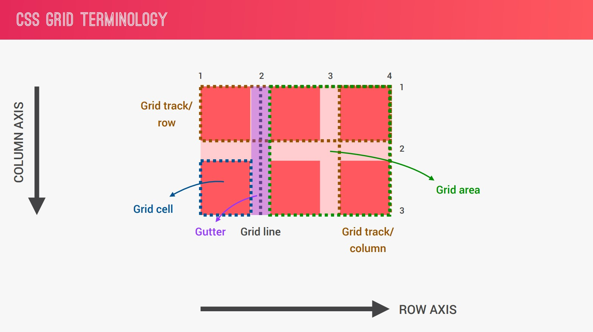
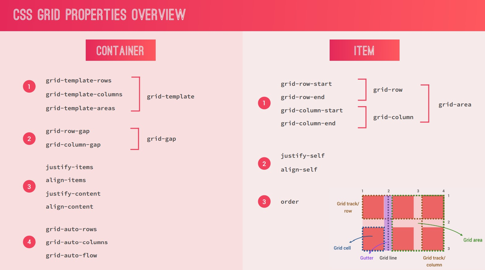

# CSS Grids

### CSS Grid Properties

- Introduction: https://codepen.io/anupam-crownstack/pen/VwzMEev?editors=1100
- repeat(), fractional unit (fr): https://codepen.io/anupam-crownstack/pen/BadwqWw?editors=1100
- Positioning Grid elements: https://codepen.io/anupam-crownstack/pen/XWaeyXX?editors=1100
- Spanning grid elements: https://codepen.io/anupam-crownstack/pen/abyLQwJ?editors=1100
  > We can have multiple grid items in same cell specifying `grid-row` & `grid-column` same for 2 elements so that they occupy same cell. By using `z-index` we can show the element hidden below.
- Grid Layout Challenge (Self-try): https://codepen.io/anupam-crownstack/pen/xxLXQjL?editors=1100
